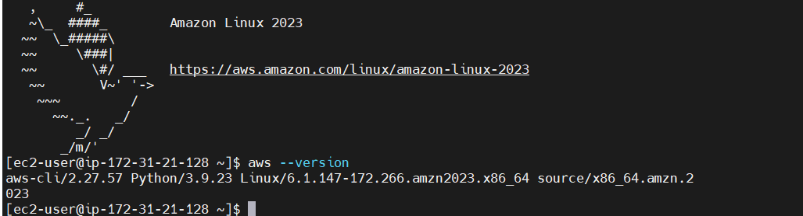
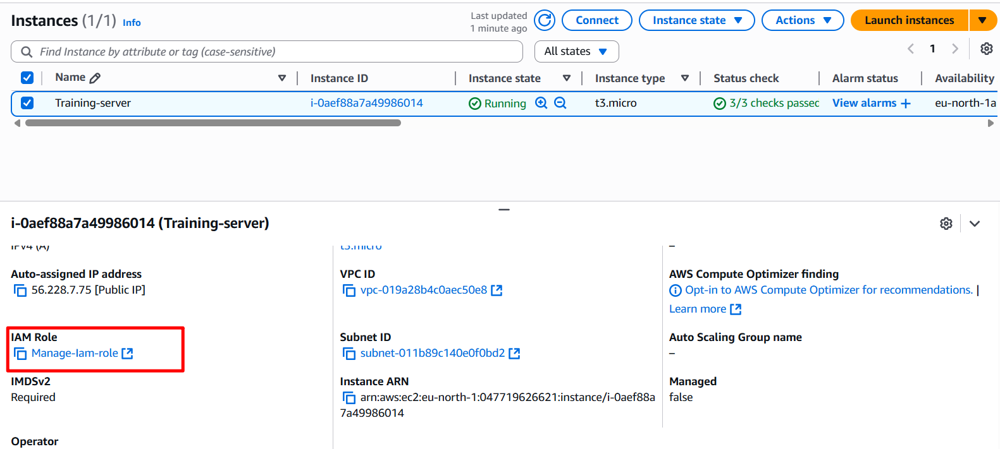

# Automating IAM Management using Shell script

Using *AWS CLI* to access and management AWS Resource.
we are going to learn how to automate the;
 - creation USERS.
 - creation GROUPS (e.g an admin group).
 - creation of an administrative policy and add it to the "admin" group to grant administrative privileges.
 

 ## Steps am following

 - **Create an EC2 instance** :
     some ec2 instances comes with *aws cli*, this depends on the AMI( operating system distribution). EC2 like Amazon linux comes with a default *AWS CLI*. so i will be creating an amazon linux EC2 for the script.

     check for AWS CLI on your EC2 by using 
     > aws --version

     if installed you will get a response like this 
     

     else install it using the following code
     For RHEL / CentOS
     > sudo yum install -y unzip curl
     > curl "https://awscli.amazonaws.com/awscli-exe-linux-x86_64.zip" -o "awscliv2.zip"
     > unzip awscliv2.zip
     > sudo ./aws/install

    For UBUNTU / DEBIAN

    `
    sudo apt update
    sudo apt install -y unzip curl
    curl "https://awscli.amazonaws.com/awscli-exe-linux-x86_64.zip" -o "awscliv2.zip"
    unzip awscliv2.zip
    sudo ./aws/install
    `

- **CONFIGURE THE AWS CLI** : 
    *Note*: The best(safer and efficient) way to configure aws Cli is by attaching a Role to an EC2 instance with permissions such as `IAMFullAccess` which is not adviseable instead you can use the custom permissions in the json syntax below.
    ```javascript
    {
      "Version": "2012-10-17",
      "Statement": [
        {
          "Effect": "Allow",
          "Action": [
            "iam:CreateGroup",
            "iam:AttachGroupPolicy",
            "iam:AddUserToGroup",
            "iam:CreateUser",
            "iam:DeleteUser",
            "iam:ListUsers",
            "iam:ListGroups",
            "iam:ListPolicies"
          ],
          "Resource": "*"
        }
        ]
      }

    ```
Methods for configure include:
    - create a user with permissions like in the above and use its credentials;

        - AWS Access Key ID

        - AWS Secret Access Key

        - Default region (e.g. us-east-1)

        - Default output format (json, table, or text)
    
    - we can also use the root user credentials by creating a access key 
      you can create it by following  ` click user name on the top right corner → My Security Credentials → Access Keys → Create Access Key `

    
The credentials are stored at

>  /root/.aws/credentials

>  /root/.aws/config

In this project i will go with the use of Role using the custom policy above as permission and EC2 as trust policy.



- After the creation of the EC2 instance, we need to write script which will automate our various actions. 
 you can view aws cli documentation from here: [AWS CLI DOCS](https://docs.aws.amazon.com/cli/latest/reference/)

 the general syntax is:

 ` aws [options] <command> <subcommand> [parameters] `

 e.g

check if a user exist.

 > aws iam get-user --user-name wales

 in the BASH SCRIPT called aws-iam-manager.sh in this directory,

 the code there;

  - check if aws command is installed. 
  - create a user from an array of users.
  - create a group called admin
  - attached policies to the group 
  - added users to the group.

now lets Send the code from my vscode on local machine to AWS EC2 instance using

> scp
  
